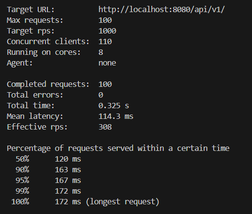

# Cluster API Testing Project

This project is designed to test and benchmark a clustered API developed with Node.js. The API leverages clustering to improve performance and scalability under load. This README provides guidelines on setting up, testing, and benchmarking the API.

## Getting Started

These instructions will help you get a copy of the project running on your local machine for development, testing purposes, and benchmark analysis.

### Prerequisites

You will need Node.js and npm installed on your machine. You can download and install Node.js from the official website [here](https://nodejs.org/en/download/).

```bash
node --version
npm --version
npm install i
```

### Setting up the project environment

1. Add a `.env` file in the root directory of the project and add the following environment variables:

```bash
MONGODB_URL=mongodb://localhost:27017/your_db_name
PORT=3000
JWT_SECRET=your_secret_key
Base_End_Point=/api/v1
```


### Responses without using clustering

##Request 1

##Request 2


### Responses using clustering

##Request 1

##Request 2

##Request 3

##Request 4


In the above responses, you can see that the response time is significantly reduced when using clustering.


